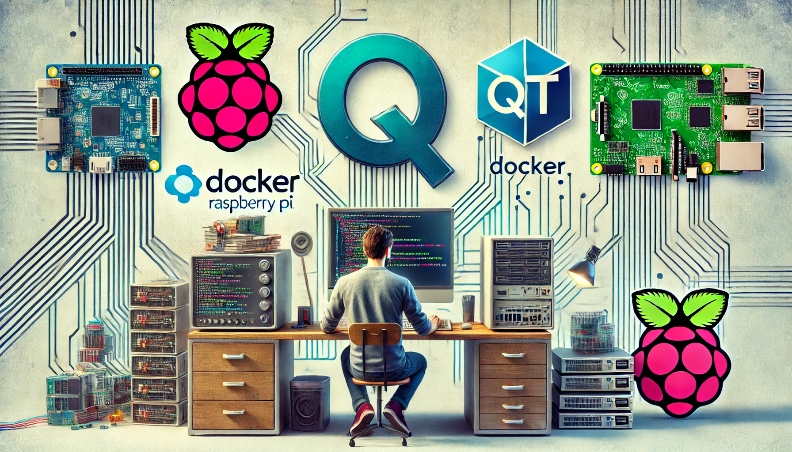
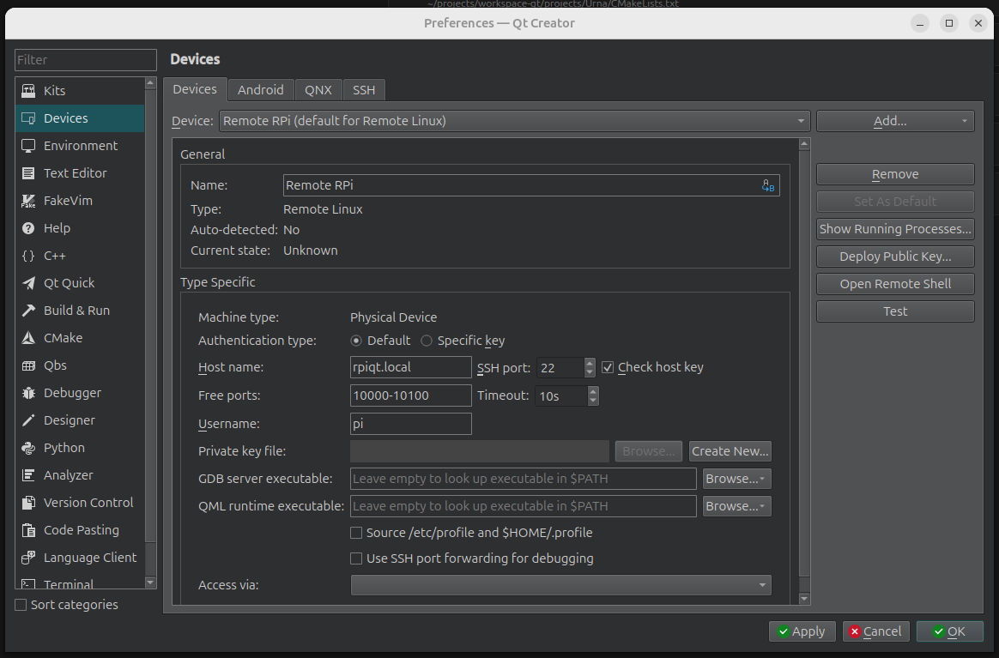
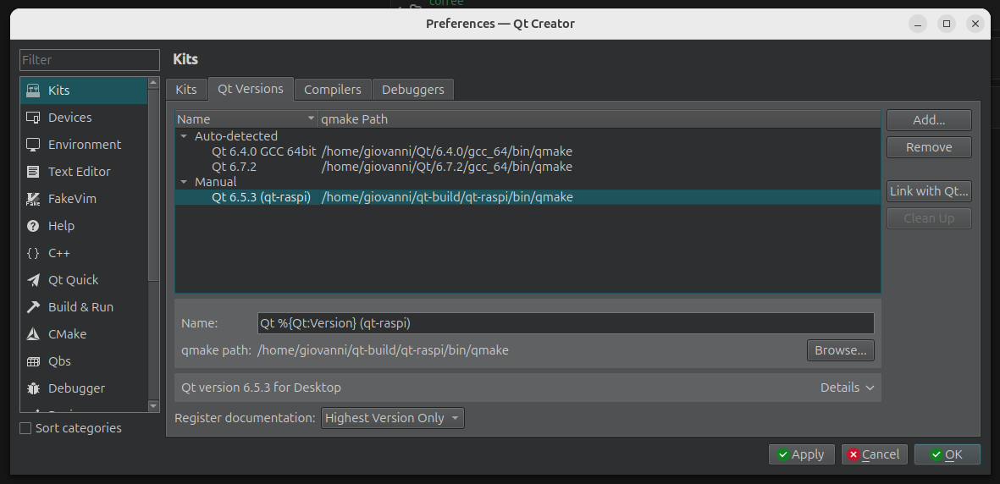
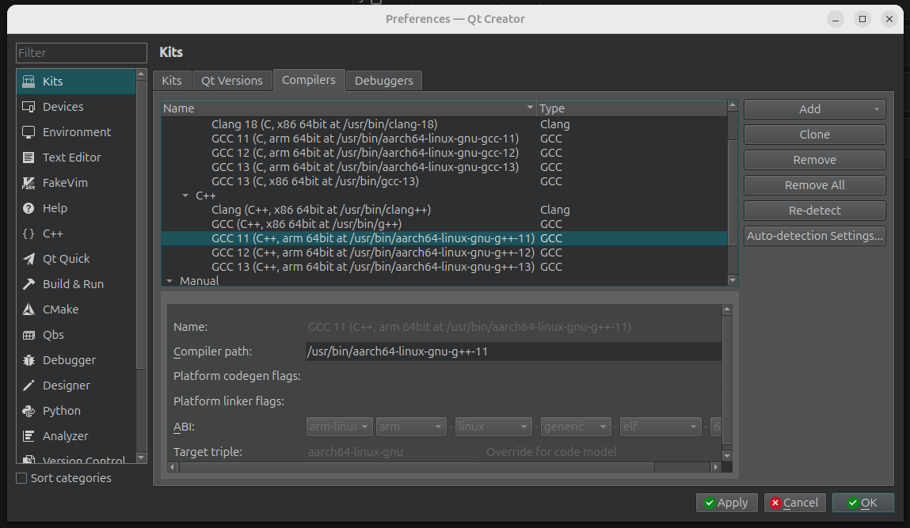
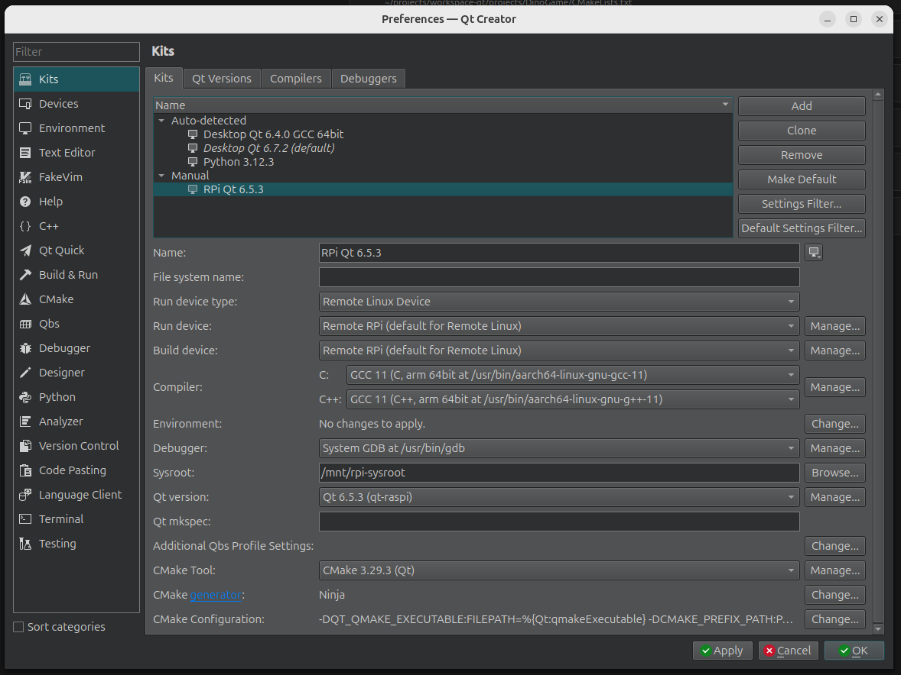
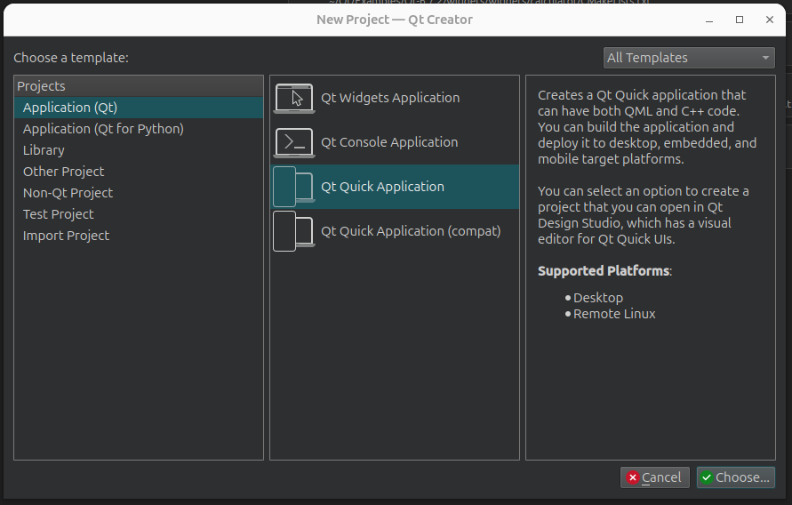
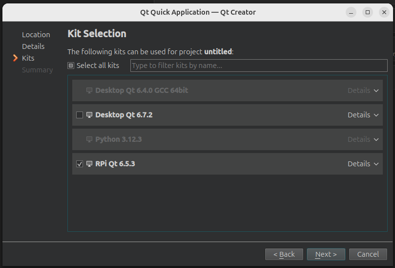
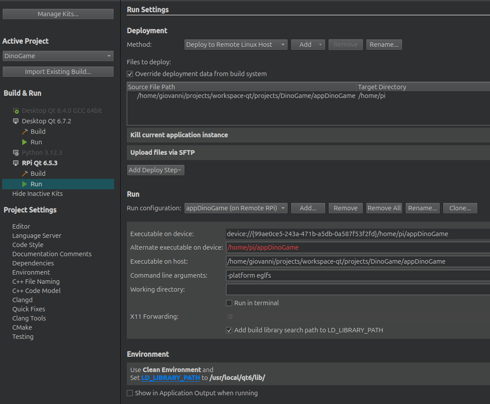

## Qt6 Docker Builder for Raspberry Pi

This Docker image builds and cross compiles Qt 6.5.3 for Raspberry Pi. 
It generates build for host and RPi so it can be used with Qt Creator after build. 
It generates a 2024-07-04-raspios-bookworm-arm64-lite.img, ready to be flashed to an SD card, containing all necessary packages and libraries to run Qt on Raspberry Pi. 

## Building the Docker image and running the container

- Install `qemu-user-static` on host machine.

```
sudo apt install qemu-user-static
```

- Clone this repo.

```
git clone https://github.com/giobauermeister/qt-rpi-docker-builder.git
```

- cd to cloned repo and build docker image

```
cd qt-rpi-docker-builder

docker build --build-arg USER=$(id -nu) --build-arg UID=$(id -u) --build-arg GID=$(id -g) --tag qt-builder/qt-builder:1.0 .
```

- Create the folder $HOME/qt-build on host machine to access build artifacts generated by container.

```
mkdir $HOME/qt-build
```

- Run a container with the image and pass $HOME/qt-build as volume

```
docker run --rm --privileged -it -v $HOME/qt-build:$HOME/qt-build qt-builder/qt-builder:1.0
```

- You should have the following build artifacts generated

```
ls -l $HOME/qt-build

2024-07-04-raspios-bookworm-arm64-lite.img
qt6
qt-raspi
qt-host
```

**2024-07-04-raspios-bookworm-arm64-lite.img**: Raspberry Pi image, containing all necessary packages and libraries to run Qt on Raspberry Pi, ready to be flashed to SD card.  
**qt6**: Qt 6.5.3 source downloaded by the docker image  
**qt-raspi**: Qt installation for Raspberry Pi  
**qt-host**: Qt installation for host machine  

## Using build artifacts with Qt Creator

- Mount generated image **2024-07-04-raspios-bookworm-arm64-lite.img**
```
sudo mkdir /mnt/rpi-sysroot
sudo mount -o loop,offset=$((1056768*512)) $HOME/qt-build/2024-07-04-raspios-bookworm-arm64-lite.img /mnt/rpi-sysroot/
```

- Open Qt Creator

- Go to `Edit -> Preferences -> Devices -> Devices` and create a new device for Raspberry Pi with SSH connection
- Give a name for the device and set ip address or hostname (eg raspberrypi.local)
- You can test connection and deploy ssh keys for passwordless access



- Go to `Edit -> Preferences -> Kits -> Qt Versions` and add _$HOME/qt-build/qt-raspi/bin/qmake_



- Go to `Edit -> Preferences -> Kits -> Compilers` and add GCC arm64 cross compiler toolchain  
(Cross toolchain can be installed using ubuntu's apt)
(This can be improved generating a cross toolchain inside container using crosstool-NG)



- Go to `Edit -> Preferences -> Kits -> Kits` and add a new Kit for RPi
- Chose the previously created Device, Compiler, Sysroot and Qt Version



- Now you can create a new project and select the RPi Kit





- When project is created go to Run Settings
- Select override deployment data from build system
- Edit source file path and target directory
- Add step 'Kill current application instance'
- Add step 'Uploade files via SFTP'
- Command line arguments should be `-platform eglfs`
- Set LD_LIBRARY_PATH to `/usr/local/qt6/lib`


